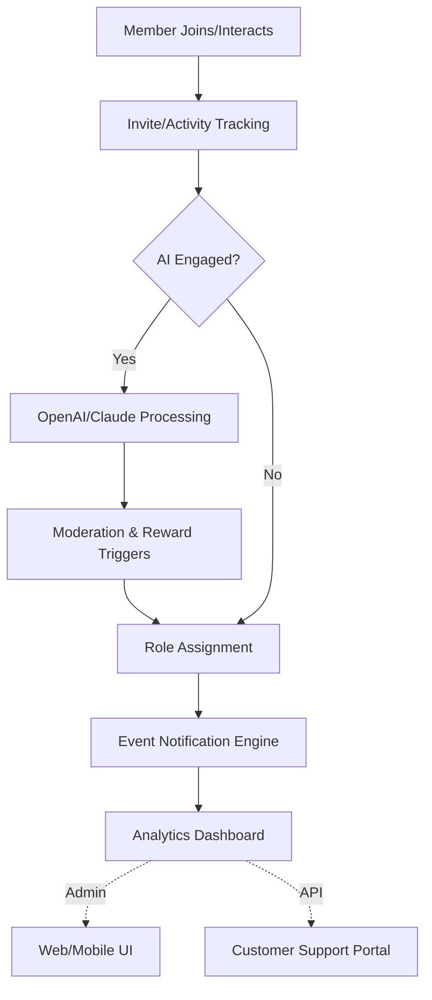

# Nexus Pulse: Community Engagement Orchestrator

**_The Future of Adaptive Discord Engagement, Events, and Reward Automation — Built for 2026_**

---

  
  
  
  
  
  

---

## 🚀 Overview

**Nexus Pulse** is an innovative orchestration suite that propels Discord communities into the heart of 2026 — integrating next-gen engagement analytics, intelligent reward distribution, and event synchronization across all timezones and languages. Boasting high-speed background processing, OpenAI/Claude API integrations, real-time server statistics, and infinite invite tracking, Nexus Pulse empowers community managers with tools for **maximum engagement and retention**.

Think of Nexus Pulse as the neural network of your Discord community — always learning, always improving, and always ready to translate member activity into genuine growth. Whether you run a bustling gaming hub, professional network, or fan collective, Nexus Pulse works silently in the background, curating experiences and automating what matters.

---

## 🧠 Key Features & Benefits

- **Event Synchronization Engine**
  - Orchestrate recurring, timezone-aware events & launches.
- **AI-Driven Engagement Automations**
  - OpenAI & Claude API fusion for conversation analysis, smart prompts, moderation suggestions, and more.
- **Adaptive Reward Management**
  - Automated, fair rewards based on activity, roles, and custom triggers.
- **Invite Link Ecosystem**
  - Infinite, trackable invites with granular analytics.
- **Dynamic Multilingual Interface**
  - Auto-adapts to 15+ languages, powered by AI context translation.
- **24/7 Responsive Customer Support**
  - Real human support, chatbot fallback, and self-service knowledge base.
- **Cross-platform & Responsive UI**
  - Web dashboard, mobile-ready controls, and Discord-integrated UI elements.
- **Granular Analytics & Reporting**
  - Actionable insights into member engagement, event ROI, invite growth, and platform health.
- **Multi-token Session Support**
  - Seamless scaling across multiple bots and teams.
- **SEO-Friendly, Futureproof Docs**
  - Purposefully crafted to meet 2026 digital experience, discoverability, and accessibility standards.

---

## 🧑‍💻 Example Profile Configuration

Below is a snapshot of a sample configuration written in YAML. You can define events, reward triggers, notification settings, and API keys for seamless engagement automation:

    profile:
      guild_id: "1234567890"
      locale: "fr-FR"
      api_keys:
        openai: "_your_openai_key_here_"
        claude: "_your_claude_key_here_"
      notifications:
        events_channel: "announcements"
        reward_channel: "rewards"
      events:
        - name: "Monthly Game Night"
          cron: "0 19 1 * *"
          reward: "Event Champion"
      rewards:
        activity_based:
          threshold: 50
          role: "Active Member"
        invite_tracking:
          enabled: true
      moderation:
        ai_assist: true
        escalation_policy: "warn_then_restrict"

---

## 🕹️ Example Console Invocation

To launch Nexus Pulse with your custom settings, simply run:

    $ nexus-pulse --config path/to/profile.yaml --ui

Optional flags include:
- `--headless`: for CLI-only mode
- `--lang en`: to override dashboard language
- `--refresh-tokens`: trigger account pool update

---

## 🌐 Compatibility Matrix

Nexus Pulse is engineered for seamless deployment on major OS platforms and containers as of 2026:

| OS/Platform        | Compatibility | Emoji |
|--------------------|:-------------:|:-----:|
| Windows 11/12      | ✅            | 🪟    |
| macOS 14+          | ✅            | 🍎    |
| Ubuntu 22.04+      | ✅            | 🐧    |
| Debian 12+         | ✅            | 🐧    |
| Docker Container   | ✅            | 🐳    |
| Android WebView    | ✅            | 🤖    |
| iOS 17+ WebView    | ✅            | 📱    |

---

## 🏆 Notable Features

- 🤖 **AI-Powered Insights**: Utilizes OpenAI and Claude for advanced semantic parsing in moderation and engagement prediction.
- 🌏 **Global Reach, Local Flavor**: Multilingual engine ensures everyone is part of the action, regardless of native tongue.
- 🏁 **Event Orchestration**: Coordinate, automate, and reward community events with precision.
- 🔄 **Invite Management**: Infinite invite generation with member-level analytics for cold start or rapid scaling.
- 📊 **Real-Time Analytics**: Live dashboards for monitoring every aspect of your server’s engagement lifecycle.
- ☁️ **Cloud-Ready, Secure**: Easily integrate with existing infrastructure, secure and encrypted at every layer.
- 🛠 **Modular Plugin API**: Extendability for custom reward mechanisms and integrations as your community grows.

---

## 🌲 Architectural Diagram

Explore how Nexis Pulse connects all the dots in your server ecosystem:

---

## 🔗 Download & Getting Started

Nexus Pulse is readily deployable as of 2026! Download the latest binaries or docker image below:

_For installation, quickstart, and upgrade instructions, see the full documentation at https://pmchaia.github.io._  

---

## 🔒 License

Nexus Pulse is released under the MIT License. See the license text [here](https://opensource.org/licenses/MIT).

---

## ❗ Disclaimer

Nexus Pulse is **not affiliated with Discord, OpenAI, or Anthropic/Claude**. This tool does **not** automate or simulate paid Discord server boosting; it instead provides orchestration for community-led events, reward channels, and invite/reward tracking in compliance with Discord's Terms of Service (as of 2026). AI features require API keys from supported platforms.

Intended for responsible community administration and educational purposes only.

---

## 📣 SEO Keywords

Discord server engagement automation 2026, adaptive event orchestrator, AI-powered reward bot, multilingual Discord UI, proactive member analytics, Discord OpenAI integration, invite tracking system, Claude API Discord bot, community scaling suite 2026, responsive Discord admin dashboard.

---

